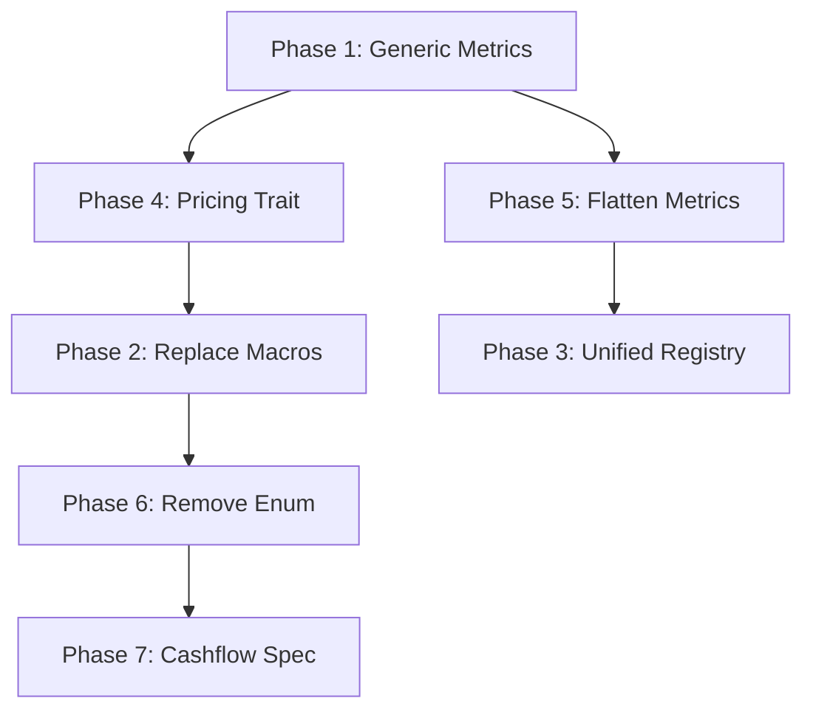

# Instruments Module Refactor Implementation Plan

## Phase 1: Consolidate Duplicated Metric Calculators
**Timeline: 2-3 days**
**Impact: -500 LOC, unified metric logic**

### Step 1.1: Create Generic BucketedDv01 Calculator
```rust
// finstack/valuations/src/instruments/common/metrics/bucketed_dv01.rs
use std::marker::PhantomData;

pub struct GenericBucketedDv01<I> {
    _phantom: PhantomData<I>,
}

pub trait HasDiscountCurve {
    fn discount_curve_id(&self) -> &CurveId;
}

impl<I> MetricCalculator for GenericBucketedDv01<I>
where
    I: Instrument + HasDiscountCurve + Clone + 'static,
{
    fn calculate(&self, context: &mut MetricContext) -> Result<F> {
        let instrument = context.instrument_as::<I>()?;
        let disc_id = instrument.discount_curve_id().clone();
        
        // Shared bucketing logic
        let labels = standard_bucket_labels();
        
        // Generic revaluation using instrument's value() method
        let inst_clone = instrument.clone();
        let curves = context.curves.clone();
        let as_of = context.as_of;
        
        let reval = move |bumped_disc: &DiscountCurve| {
            // Create temporary context with bumped curve
            let mut temp_curves = (*curves).clone();
            temp_curves.set_discount(disc_id.as_str(), bumped_disc.clone());
            inst_clone.value(&temp_curves, as_of)
        };
        
        compute_bucketed_dv01_series(context, &disc_id, labels, 1.0, reval)
    }
}
```

### Step 1.2: Migrate Each Instrument
- Delete instrument-specific BucketedDv01Calculator files
- Implement HasDiscountCurve trait for each instrument
- Update metric registration to use GenericBucketedDv01<Bond>, etc.

### Step 1.3: Apply Pattern to Other Common Metrics
- CS01 calculators (6 duplicates)
- ParSpread calculators (5 duplicates)  
- Annuity calculators (4 duplicates)

---

## Phase 2: Replace Macro-Based Trait Implementations
**Timeline: 1-2 days**
**Impact: Improved IDE navigation, -100 LOC of macro code**

### Step 2.1: Create Derive Macro for Instrument
```rust
// finstack-macros/src/lib.rs
#[proc_macro_derive(Instrument, attributes(instrument))]
pub fn derive_instrument(input: TokenStream) -> TokenStream {
    // Generate standard Instrument trait implementation
}
```

### Step 2.2: Replace macro invocations
```rust
// Before: 
crate::impl_instrument_schedule_pv!(
    Bond, "Bond",
    disc_field: disc_id,
    dc_field: dc
);

// After:
#[derive(Instrument)]
#[instrument(name = "Bond", discount_field = "disc_id", daycount_field = "dc")]
impl Bond {
    // Explicit implementation visible in IDE
}
```

### Step 2.3: Delete old macros
- Remove `impl_instrument!` and `impl_instrument_schedule_pv!`
- Update all 30+ instruments to use derive

---

## Phase 3: Unify Metric Registration  
**Timeline: 1 day**
**Impact: -400 LOC, single source of truth**

### Step 3.1: Create Declarative Registry
```rust
// finstack/valuations/src/metrics/registry.rs
pub struct MetricRegistryBuilder {
    mappings: Vec<MetricMapping>,
}

struct MetricMapping {
    metric_id: MetricId,
    instruments: Vec<&'static str>,
    calculator: Arc<dyn MetricCalculator>,
}

impl MetricRegistryBuilder {
    pub fn register_all() -> MetricRegistry {
        let mut builder = Self::new();
        
        // Single declarative list
        builder
            .metric(MetricId::BucketedDv01)
                .for_instruments(&["Bond", "Deposit", "IRS", "FRA"])
                .with_generic::<GenericBucketedDv01>()
            .metric(MetricId::Ytm)  
                .for_instrument("Bond")
                .with_calculator(YtmCalculator)
            .metric(MetricId::Delta)
                .for_instruments(&["EquityOption", "FxOption", "Swaption"])
                .with_generic::<GenericDelta>()
            // ... all metrics in one place
            .build()
    }
}
```

### Step 3.2: Delete per-instrument registration functions
- Remove all `register_*_metrics()` functions
- Single call to `MetricRegistryBuilder::register_all()`

---

## Phase 4: Consolidate Pricing Engine Patterns
**Timeline: 2 days**  
**Impact: -300 LOC, standardized pricing flow**

### Step 4.1: Extract Common Pricing Trait
```rust
// finstack/valuations/src/instruments/common/pricing.rs
pub trait PricingEngine: Sized {
    type Instrument;
    
    /// Standard NPV calculation
    fn npv(
        &self,
        instrument: &Self::Instrument,
        context: &MarketContext,
        as_of: Date,
    ) -> Result<Money>;
    
    /// Default implementation for schedule-based instruments
    fn npv_from_schedule(
        &self,
        flows: &DatedFlows,
        disc_curve: &DiscountCurve,
    ) -> Result<Money> {
        // Standard discounting logic
        common::discountable::npv_static(disc_curve, flows)
    }
}
```

### Step 4.2: Simplify Engine Implementations
```rust
// Before: bond/pricing/engine.rs (60 lines)
// After:
pub struct BondEngine;

impl PricingEngine for BondEngine {
    type Instrument = Bond;
    
    fn npv(&self, bond: &Bond, context: &MarketContext, as_of: Date) -> Result<Money> {
        let flows = bond.build_schedule(context, as_of)?;
        let disc = context.get_discount_ref(&bond.disc_id)?;
        self.npv_from_schedule(&flows, disc)
    }
}
```

### Step 4.3: Remove redundant pricer wrappers
- Delete `pricing/pricer.rs` files that just forward to engine
- Expose engine directly

---

## Phase 5: Flatten Metrics Module Hierarchy
**Timeline: 1 day**
**Impact: -200 files, easier navigation**

### Step 5.1: Consolidate Related Metrics
```rust
// Before: 15 files in bond/metrics/
// After: 2 files

// bond/bond_metrics.rs - All bond-specific metrics
mod ytm;
mod duration;
mod convexity;
mod spreads;

pub use ytm::YtmCalculator;
pub use duration::{MacaulayDuration, ModifiedDuration};
// ...

// bond/mod.rs
pub mod bond_metrics;
pub use bond_metrics::*;
```

### Step 5.2: Group by Metric Category
- `price_metrics.rs` - Clean/dirty price, accrued
- `risk_metrics.rs` - Duration, convexity, DV01
- `spread_metrics.rs` - YTM, Z-spread, OAS, I-spread
- `credit_metrics.rs` - CS01, hazard sensitivities

---

## Phase 6: Remove InstrumentType Enum Mapping
**Timeline: 0.5 days**
**Impact: No more manual enum updates**

### Step 6.1: Add Associated Constant
```rust
pub trait Instrument {
    const TYPE_ID: &'static str;
    
    fn instrument_type(&self) -> &'static str {
        Self::TYPE_ID
    }
    
    // Remove key() method entirely
}

impl Instrument for Bond {
    const TYPE_ID: &'static str = "Bond";
}
```

### Step 6.2: Use TypeId for Dispatch
```rust
// In pricer selection
fn select_pricer(instrument: &dyn Instrument) -> Box<dyn Pricer> {
    let type_id = instrument.as_any().type_id();
    
    match TYPE_MAP.get(&type_id) {
        Some(pricer_fn) => pricer_fn(),
        None => panic!("No pricer for {:?}", type_id),
    }
}

lazy_static! {
    static ref TYPE_MAP: HashMap<TypeId, fn() -> Box<dyn Pricer>> = {
        let mut m = HashMap::new();
        m.insert(TypeId::of::<Bond>(), || Box::new(BondPricer));
        m.insert(TypeId::of::<Deposit>(), || Box::new(DepositPricer));
        m
    };
}
```

---

## Phase 7: Simplify Cashflow Builder Patterns  
**Timeline: 1 day**
**Impact: Clearer API, fewer edge cases**

### Step 7.1: Create CashflowSpec Enum
```rust
pub enum CashflowSpec {
    /// Standard coupon bond
    Fixed {
        coupon: F,
        freq: Frequency,
        dc: DayCount,
    },
    /// Floating rate note
    Floating {
        index: CurveId,
        margin_bp: F,
        reset_freq: Frequency,
    },
    /// User-provided schedule
    Custom(CashFlowSchedule),
    /// Amortizing bond
    Amortizing {
        base: Box<CashflowSpec>,
        schedule: AmortizationSpec,
    },
}

impl Bond {
    pub fn with_cashflows(mut self, spec: CashflowSpec) -> Self {
        self.cashflow_spec = spec;
        self
    }
}
```

### Step 7.2: Simplify Schedule Building
```rust
impl CashflowProvider for Bond {
    fn build_schedule(&self, context: &MarketContext, as_of: Date) -> Result<DatedFlows> {
        match &self.cashflow_spec {
            CashflowSpec::Fixed { coupon, freq, dc } => {
                // Generate fixed schedule
                build_fixed_schedule(self.notional, *coupon, *freq, *dc, self.maturity)
            }
            CashflowSpec::Custom(schedule) => Ok(schedule.clone()),
            CashflowSpec::Floating { .. } => {
                // Project floating coupons
                build_floating_schedule(/* ... */)
            }
            CashflowSpec::Amortizing { base, schedule } => {
                let base_flows = /* recurse with base */;
                apply_amortization(base_flows, schedule)
            }
        }
    }
}
```

---

## Implementation Order & Dependencies



## Testing Strategy

### Unit Tests
- Test generic calculators against existing instrument-specific tests
- Ensure numerical parity before/after refactor

### Integration Tests  
- End-to-end pricing tests remain unchanged
- Add tests for new generic interfaces

### Performance Tests
- Benchmark generic vs specific implementations
- Ensure no performance regression from dynamic dispatch

## Rollback Plan
- Each phase is atomic and can be reverted independently
- Keep old implementations in `legacy/` module during transition
- Feature flag for gradual migration: `features = ["use-generic-metrics"]`
